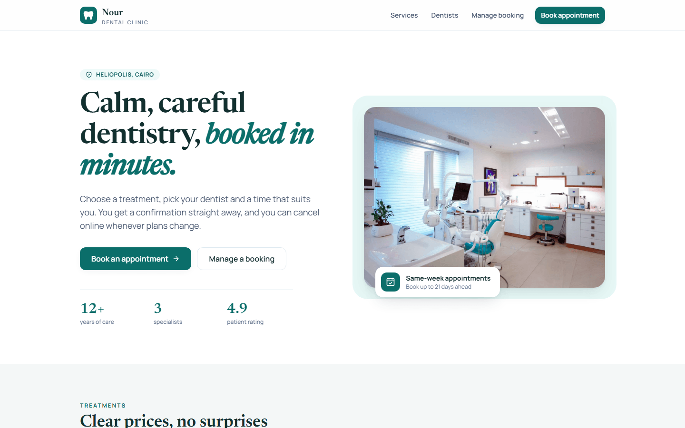
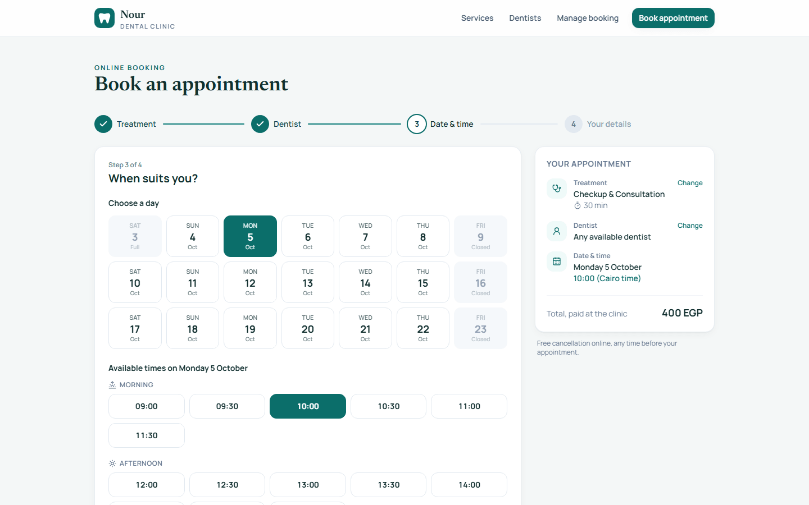
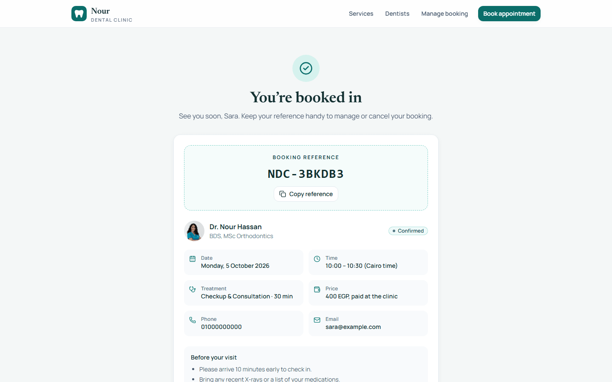
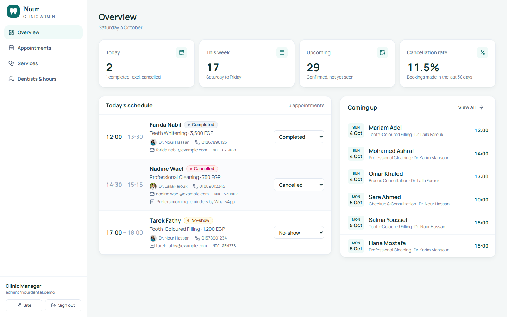
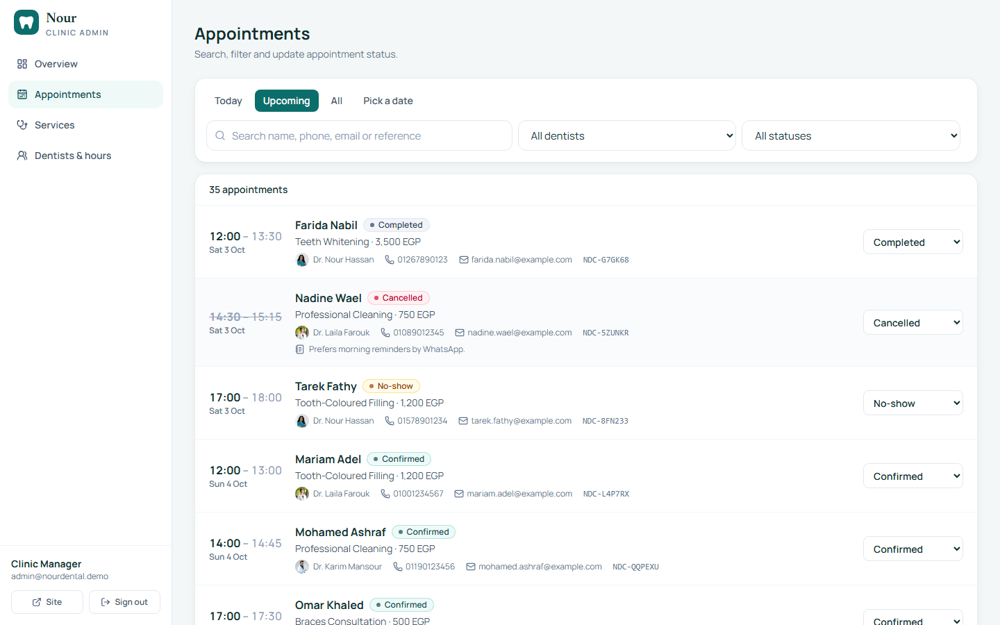
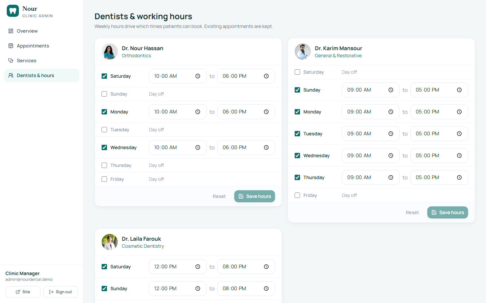

# Nour Dental Clinic: appointment booking

> **Concept project.** Nour Dental Clinic is fictional. The doctors, prices and appointments are demo data, and no messages are ever sent.

A full-stack booking system for a small dental clinic. Patients book in a five-step flow with live availability. Staff manage the schedule from a protected dashboard.

**Live demo:** https://nour-clinic-silk.vercel.app · **Admin demo:** `admin@nourdental.demo` / `NourDemo2026` (also shown on the login page)

## Screenshots

| Home | Booking: date & time | Confirmation |
| --- | --- | --- |
|  |  |  |

| Admin overview | Appointments | Working hours |
| --- | --- | --- |
|  |  |  |

_(Placeholders: drop PNGs with these names into `docs/screenshots/`.)_

## Features

**Patients**
- Choose a treatment (duration and price in EGP), a dentist or "any available", a day in the next 21 days, then a time slot.
- Slots are calculated on the server from each dentist's working hours, the service duration and existing bookings.
- Validated contact form, then a confirmation page with a reference such as `NDC-7K4QX2`.
- Look up or cancel a booking with the reference and phone number.
- If someone takes your slot while you're filling in the form, you get a clear message and go back to the time picker, which now shows fresh availability.

**Staff (`/admin`)**
- JWT session in an httpOnly cookie; all admin routes are protected.
- Overview: today's appointments, this week, upcoming, cancellation rate, today's schedule and what's coming up.
- Appointments: Today / Upcoming / All / pick-a-date views, filter by dentist and status, search by name, phone, email or reference, pagination, inline status changes (confirmed, completed, cancelled, no-show).
- Services: create, edit, hide/show and delete. Deleting is refused if the service has appointment history.
- Dentists: edit weekly working hours.

**Daily demo reset**
- A Vercel Cron job calls `GET /api/cron/reset-demo` once a day (02:00 UTC, about 04:00–05:00 in Cairo). It wipes all demo tables and reseeds services, dentists, working hours, the demo admin and about 60 appointments spread from 10 days ago to 10 days ahead of the current date, all in one transaction. The admin login page says "Demo data resets daily."

**Quality**
- Responsive down to 375px, checked in the browser. Keyboard focus rings use `:focus-visible` only. lucide icons, no emoji.
- Loading skeletons, empty states, error states with retry, and toasts.
- Strict TypeScript everywhere, with no `any`.

## Architecture

```
nour-clinic/
├── api/index.ts           Vercel serverless entry → hands requests to the Fastify app
├── server/
│   ├── app.ts             Fastify factory: plugins, error format, route registration
│   ├── routes/            public.ts (services, availability, bookings) · admin.ts
│   ├── services/          catalog, availability, bookings, admin (all DB logic)
│   ├── lib/slots.ts       Pure slot calculation (unit tested)
│   ├── plugins/auth.ts    JWT cookie session helpers
│   ├── db/                Drizzle schema, client, migrate + seed scripts
│   └── tests/             Vitest: slots + double-booking (PGlite) + HTTP API
├── shared/                Types, Zod schemas, constants and timezone helpers used by both sides
├── client/                React + Vite + Tailwind SPA
│   └── src/{pages,features,components,lib}
└── drizzle/               SQL migrations (0001 adds the no-overlap exclusion constraint)
```

- **Frontend:** React 19, TypeScript, Vite, Tailwind CSS v4, React Router, TanStack Query, sonner (toasts) and lucide-react. The admin area is code-split.
- **Backend:** Fastify 5 with Zod validation, Drizzle ORM on node-postgres, `@fastify/jwt`, `@fastify/cookie`, `@fastify/rate-limit` and bcrypt (`bcryptjs`).
- **Database:** Neon Postgres. Times are stored as `timestamptz` (UTC). All scheduling is done in the clinic's timezone, `Africa/Cairo`, which handles Egypt's DST.
- **Deployment:** one Vercel project. `vite build` produces the static site in `dist/`. `api/index.ts` is a Node serverless function, and `vercel.json` rewrites `/api/*` to it with an SPA fallback for everything else.

### How double booking is prevented

1. **In the app:** before inserting, the server recalculates availability. A start time that's off the schedule grid returns `422 INVALID_SLOT`; one that's already taken returns `409 SLOT_TAKEN`.
2. **In the database:** a Postgres exclusion constraint (needs `btree_gist`) rejects any overlapping time range for the same dentist, unless the appointment is cancelled:
   ```sql
   EXCLUDE USING gist (doctor_id WITH =, tstzrange(starts_at, ends_at, '[)') WITH &&)
   WHERE (status <> 'cancelled')
   ```
   When two requests race, the losing insert fails with SQLSTATE `23P01`, which becomes `409 SLOT_TAKEN`. For "any available", the server tries the next free dentist before giving up.

The tests cover this against a real Postgres engine (PGlite running the real migrations): six simultaneous requests for one slot give exactly one booking. A raw SQL insert that bypasses the app is also rejected.

### Booking rules

- Bookings can be made from today up to 21 days ahead (clinic time). Start times are every 30 minutes, and the whole service must fit inside the shift.
- No bookings in the past. Same-day bookings need at least **2 hours' notice** (enforced both in slot listing and on create).
- Patients can cancel online until the appointment starts.

### Error format

Every error response looks like this:

```json
{ "error": { "code": "SLOT_TAKEN", "message": "Sorry, that time was just booked…", "details": [{ "path": "patientEmail", "message": "…" }] } }
```

`details` only appears for validation errors. Status codes used: `400` validation, `401` unauthenticated or bad credentials, `404` not found, `409` conflict (slot taken, service in use, not cancellable), `422` business-rule violation (too soon, outside hours or window), `429` rate limited, `500` unexpected.

## API

All endpoints are under `/api`.

| Method | Path | Auth | Description |
| --- | --- | --- | --- |
| GET | `/health` | | Health check |
| GET | `/services` | | Active services |
| GET | `/doctors` | | Active dentists with weekly hours |
| GET | `/availability/days?serviceId&doctorId=any\|id` | rate limited | 21-day summary: open and number of free slots per day |
| GET | `/availability/slots?serviceId&doctorId&date=YYYY-MM-DD` | rate limited | Free start times for a day, with which dentists are free |
| POST | `/bookings` | rate limited (10 / 10 min / IP) | Create a booking → `201 { booking }` |
| POST | `/bookings/lookup` | rate limited | `{ reference, phone }` → booking |
| POST | `/bookings/:reference/cancel` | rate limited | `{ phone }` → cancelled booking |
| POST | `/admin/login` | rate limited (10 / 15 min) | Sets the `nour_admin` httpOnly cookie |
| POST | `/admin/logout` | | Clears the cookie |
| GET | `/admin/me` | admin | Current admin |
| GET | `/admin/stats` | admin | Today, this week, upcoming, cancellation rate |
| GET | `/admin/appointments?date\|from&to&doctorId&status&q&page&pageSize` | admin | Filtered, paginated list |
| PATCH | `/admin/appointments/:id` | admin | `{ status }` |
| GET / POST | `/admin/services` | admin | List (including hidden) / create |
| PUT / DELETE | `/admin/services/:id` | admin | Update / delete (409 if it has appointments) |
| GET | `/admin/doctors` | admin | Dentists with hours |
| PUT | `/admin/doctors/:id/hours` | admin | Replace weekly hours `{ hours: [{ weekday, startMin, endMin }] }` |
| GET | `/cron/reset-demo` | `Authorization: Bearer $CRON_SECRET` | Wipe and reseed demo data (Vercel Cron). `401` without the secret, `503` if `CRON_SECRET` isn't set |

## Running locally

Requirements: Node 22+ and a Postgres 14+ database (a free Neon branch works, or a local Postgres).

```bash
npm install
cp .env.example .env        # then fill in DATABASE_URL and JWT_SECRET
npm run db:migrate          # applies drizzle/ migrations (incl. btree_gist + exclusion constraint)
npm run db:seed             # demo admin, 5 services, 3 dentists, ~60 demo appointments
npm run dev                 # API on :3001, Vite on :5173 (proxies /api)
```

| Script | What it does |
| --- | --- |
| `npm run dev` | Fastify (tsx watch) and Vite together |
| `npm test` | Vitest: slot logic, double booking, HTTP API (in-memory PGlite, no DB needed) |
| `npm run typecheck` | `tsc` for the client and server projects |
| `npm run build` | Production build of the SPA into `dist/` |
| `npm run db:generate` | Generate a migration after editing `server/db/schema.ts` |
| `npm run db:migrate` / `db:seed` | Apply migrations / seed (idempotent; demo appointments only when the table is empty) |
| `npm run db:reset` | Wipe and reseed the demo data (what the daily cron does) |

### Environment variables

| Name | Required | Description |
| --- | --- | --- |
| `DATABASE_URL` | yes | Postgres connection string. On Neon, use the pooled URL with `sslmode=require`. |
| `JWT_SECRET` | yes | At least 32 characters; signs admin session tokens. |
| `CRON_SECRET` | for the reset | Bearer token for `/api/cron/reset-demo`. Vercel Cron sends it automatically. Without it, the endpoint is disabled. |

`.env*` files are git-ignored. Only `.env.example` is committed.

### Deploying to Vercel

1. Import the repo into Vercel (the production branch is `master`). `vercel.json` already sets the build, output and rewrites.
2. Add `DATABASE_URL`, `JWT_SECRET` and `CRON_SECRET` as environment variables. The cron schedule is in `vercel.json`.
3. Run `npm run db:migrate && npm run db:seed` once against the production database.

## Decisions made

- **Single package, not a monorepo.** `client/`, `server/` and `shared/` live in one `package.json`, which keeps one Vercel project and one install simple. Shared code is imported with a `@shared/*` alias on the client and relative `.js` paths on the server (NodeNext).
- **Exclusion constraint instead of locking.** A GiST exclusion constraint is race-proof without explicit transactions or advisory locks, and it also guards against partial overlaps, which a unique index on `(doctor_id, starts_at)` would miss. Cancelled rows are excluded so cancelling frees the slot.
- **Clinic timezone is fixed to `Africa/Cairo`.** Working hours are wall-clock minutes. A small `Intl`-based helper converts them to UTC, so there are no timezone dependencies, and the tests cover both summer and winter offsets.
- **30-minute slot grid, 21-day window, 2 hours' notice** are constants in `shared/constants.ts`.
- **"Any available" spreads the load:** if several dentists are free, the one with the fewest bookings that day is chosen.
- **Every dentist offers every service.** A service-to-dentist mapping would be a natural next step.
- **One working block per dentist per weekday** (no split shifts or holidays). This keeps the hours editor simple.
- **Phone numbers** are normalised (spaces, dashes and brackets removed) and accepted as 8–15 digits with an optional `+`, so international patients aren't blocked. Lookup requires reference and phone together, and the response doesn't reveal which one was wrong.
- **Prices are whole EGP integers** and are copied onto each appointment, so later price changes don't rewrite history.
- **Rate limiting is in-memory per function instance** (`@fastify/rate-limit`). That's fine for a demo; production would use a shared store such as Redis or the Vercel WAF.
- **`bcryptjs`** (pure JS) instead of native `bcrypt`, to avoid native builds on Vercel. Login compares against a dummy hash for unknown emails, so timing doesn't reveal which accounts exist.
- **Session cookie:** `httpOnly`, `SameSite=Lax`, `Secure` in production, 8-hour expiry. The SPA and API share an origin, so no CORS is needed.
- **Demo credentials are public** on the login page, as requested for a concept project. Anyone can change the demo data; the daily reset restores it.
- **Daily reset with `TRUNCATE … RESTART IDENTITY` inside one transaction.** Visitors never see a half-empty clinic, and ids stay stable (dentist 1–3, service 1–5). The schedule is once a day so it works on the Hobby plan, which only allows daily crons with loose timing. The secret check uses a constant-time comparison, and the endpoint fails closed when `CRON_SECRET` is missing.
- **Booking draft is kept in `sessionStorage`**, so a refresh mid-flow doesn't lose progress. Expired slots are dropped on reload.
- **Tests use PGlite** (Postgres compiled to WASM, with `btree_gist`), so `npm test` runs the real migrations and constraint without any external database.
- **Palette:** deep teal (`#0b6e6a`), white and soft slate grays, with Manrope for text and Newsreader for headings, to feel calm and clinical.
- **Images** come from images.unsplash.com (hot-linked with size parameters).

## License

MIT. Images belong to their respective Unsplash photographers.
